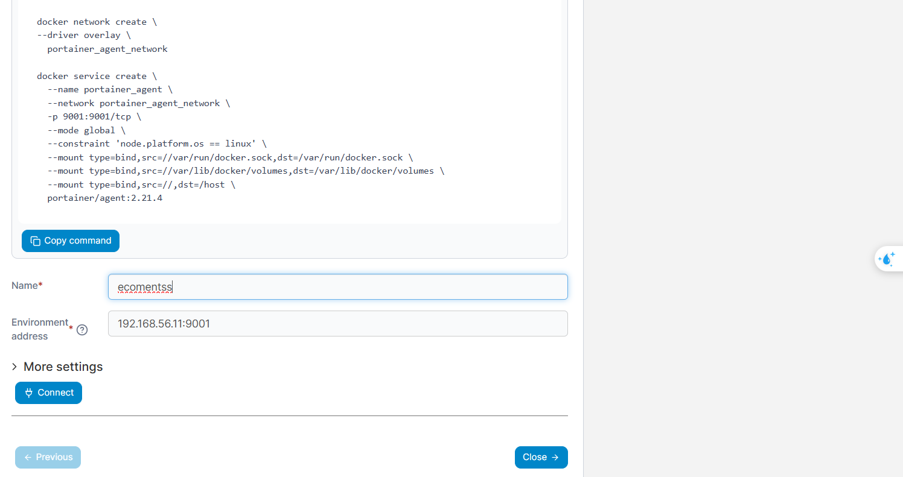

# Thực hiện
## Setup vagrant để tạo máy ảo
+ Bước 1: chạy các máy ảo host sử dụng `vagrant up`
+ Bước 2: Truy cập vào các máy host để đk node swarm
  - kiểm tra các máy host đang chạy `vagrant status`
  - truy cập vào `vagrant ssh manager1`. user `vagrant` pass `vagrant`
## Tạo docker swarm và join
+ Bước 3: init swarm và join các máy con vào swarm chạy lệnh `./setup_swarn.sh` lưu ý không cần vào vào từng máy ảo khác để join vì sh script đã connect ssh vào từng máy và tự động kết nối.

## Sử dụng portainer để quản lý
+ Bước 4: Chạy vào khởi tạo  portainer
```
docker volume create portainer_data
docker run -d -p 9000:9000 -p 9443:9443 --name portainer \
  -v /var/run/docker.sock:/var/run/docker.sock \
  -v portainer_data:/data \
  portainer/portainer-ce:latest
```
+ Bước 5: Tạo mạng Overlay 
  - Mục đích: để các container của các node trong Swarm connect với nhau
```
docker network create \
--driver overlay \
  portainer_agent_network
```

+ Bước 6: Tạo Service Portainer Agent
  - Mục đích: giúp Portainer quản lý Docker daemon từ xa  trên tất cả các nodes của Swarm
```
docker service create \
  --name portainer_agent \
  --network portainer_agent_network \
  -p 9001:9001/tcp \
  --mode global \
  --constraint 'node.platform.os == linux' \
  --mount type=bind,src=//var/run/docker.sock,dst=/var/run/docker.sock \
  --mount type=bind,src=//var/lib/docker/volumes,dst=/var/lib/docker/volumes \
  --mount type=bind,src=//,dst=/host \
  portainer/agent:2.21.4

```

+ Bước 7: add trên giao diện của portainer
```
- truy cập http://localhost:9000/  -- đăng nhập
- vào mục Environments
- nhấn nút add Environments
- chọn docker swarm
- start  Wizard
- điền thông tin portainer_agent đã chạy ở trên 
- nhấn connect
```


+ thực hành theo các lệnh swarm [ở đây](https://github.com/trantronghien/docker/wiki/Docker-Swarm#th%E1%BB%B1c-h%C3%A0nh-docker-swarm)

___
# Vagrant
## Một số khái niệm Vagrant
+ `box`: là VM image mà Vagrant sử dụng để tạo ra máy ảo.
+ `Provisioning`: Sau khi nó được tạo ra cấu hình để tự động hóa việc cài đặt phần mềm và cấu hình máy ảo.
`Synced Folders`: Chia sẻ thư mục giữa máy chủ và máy ảo

## Một số lệnh Vagrant 
```
vagrant up -- ko có param [machine_name] thì hiểu apply hết tất cả
vagrant up [machine_name]  -- chạy máy ảo dựa trên cấu hình trong Vagrantfile
vagrant ssh [machine_name]  -- Kết nối SSH vào máy ảo
vagrant provision [machine_name] -- Chạy lại các script cấu hình (provisioning) mà không cần khởi động lại máy ảo.
vagrant global-status -- Liệt kê trạng thái của tất cả các máy ảo Vagrant trên hệ thống. Bao gồm name và id 
vagrant status  -- Hiển thị trạng thái của máy ảo trong thư mục chứa Vagrantfile hiện tại.
vagrant reload [machine_name]-- Khởi động lại máy ảo và áp dụng các thay đổi trong Vagrantfile
vagrant destroy -f [machine_name] -- Xóa hoàn toàn máy ảo và các tài nguyên liên quan

# lệnh export 1 máy ảo ra 1 vagrant box để chạy các máy ảo trên box này không cần phải cài lại các phần mềm từ đâu khi máy ảo mới được tạo
vagrant package --base [machine_name] --output my-docker-box.box
vagrant box list -- Liệt kê các box đang được cài đặt
vagrant ssh-config -- hiện thi tất cả các cấu hình ssh của máy ảo trong folder 
```
## một số lưu ý 
+ đường dẫn `private_key` kết nối ssh của máy ảo default `.vagrant/machines/default/virtualbox/private_key`
+ đường dẫn `private_key` kết nối ssh của máy ảo sử dụng custom box `C:/Users/<pc_username>/.vagrant.d/boxes/my_box_docker/0/virtualbox/vagrant_private_key`

##  Network Kết nối từ máy host và máy ảo 
+ private_network: chỉ có máy host mới có thể kết nối được với máy ảo thông qua ip
+ forward port: máy host truy cập vào máy ảo qua port được forward
+ public_network: sử dụng chung mạng với máy host, sử dụng chung card mạng


### Thực hành với SMB
+ chạy deploy stack
```
# build image app với docker-compose
docker-compose -f swarm-stack.yml build
``` 
+ Bước 1: Tạo ổ đĩa mạng SMB cho dịch vụ trên swarm. thường được tạo trên node manager leader luôn, vì vậy chạy lệnh trên máy host node manager.
 =============================== Tiếp tục làm =======================================
 - đã chạy được swarm 
 - Samba lỗi không mount vào được 

```
docker volume create \
    --driver local \
    --opt type=cifs \
    --opt device=//192.168.99.107/mydata \
    --opt o=username=testuser,password=123456,file_mode=0777,dir_mode=0777 \
    --name vtest
```

# Một số vấn đề gặp phải 
## Vấn đề 1: Share Image
+ khi chạy docker stack với cấu hình 1 task nào đó được build từ dockerfile thì docker sẽ tự tạo image trên Registry của chính node đó. những node khác không có sẽ bị lỗi. khắc phục
+ Cách 1: là đẩy image đã build lên `Docker Hub` hoặc 1 `Private Registry(hub)`
+ Cách 2: Sử Dụng Local Registry với Docker Swarm
```
# Khởi tạo một dịch vụ registry
docker service create --name registry --publish published=5000,target=5000 --constraint 'node.role == manager' registry:2
Lệnh trên sẽ:
+ Tạo một dịch vụ tên là registry. 
+ với registry:2 là tên image sử dụng với version 2
+ Public cổng 5000, để các node khác trong Swarm có thể truy cập thông qua <manager-ip>:5000.
# Gán tag cho image với địa chỉ của registry cục bộ
docker tag my-node-app:latest <manager-ip>:5000/my-node-app:latest
# Push image lên registry cục bộ
docker push <manager-ip>:5000/my-node-app:latest
# Cấu hình file docker-stack.yml
services:
  app:
    image: <manager-ip>:5000/my-node-app:latest

# Kiểm tra ở các node khác với lệnh pull image từ registry đc dk trên manager 
docker pull <manager-ip>:5000/my-node-app:latest

# thêm cấu hình cho daemon của từ node thêm insecure-registries
/etc/docker/daemon.json
{
        ...
        "insecure-registries": ["<manager-ip>:5000"]
        ...
}
sudo systemctl restart docker   --> start lại docker
```

+ Cách 3: Sử Dụng Lệnh docker save và docker load để Phân Phối Image Thủ Công
```
# B1: Export image từ node build
docker save my-node-app:latest -o my-node-app.tar
# B2: Copy file image (my-node-app.tar) sang các node khác
# B3: Load image vào Docker trên các node khác
docker load -i my-node-app.tar
```

## Vấn đề 2: Share và đồng bộ Dữ liệu giữa các node
+ trong docker swarm các task(container) trong các node(machine) khác nhau **không thể truy cập cùng một volume**. Giải pháp sử dụng volume loại **networked storage** hoặc **volume driver** hỗ trợ chia sẻ dữ liệu trên các node khác nhau.

### Một số loại networked storage
+ NFS (Network File System)
+ SMB (Server Message Block)
+ GlusterFS
+ Portworx
+ Rex-Ray

## Vấn đề 3: Tại sao các container trong Docker Swarm có thể sử dụng cùng một cổng mà không gặp xung đột?
+ Docker Swarm sử dụng cơ chế **Load Balancing, Virtual IP, và Overlay Network** để phân phối lưu lượng đến các task (container) khác nhau, cho phép các task trong cùng một service lắng nghe trên cùng một cổng mà không gây xung đột.
+ Khi chạy docker swarn service trên 3 node khác nhau thì truy cập bằng ip hoặc host của bất kỳ của node nào cũng được vì Docker Swarm tự phân phối nhờ Load Balancing.


docker exec -it nfs bash